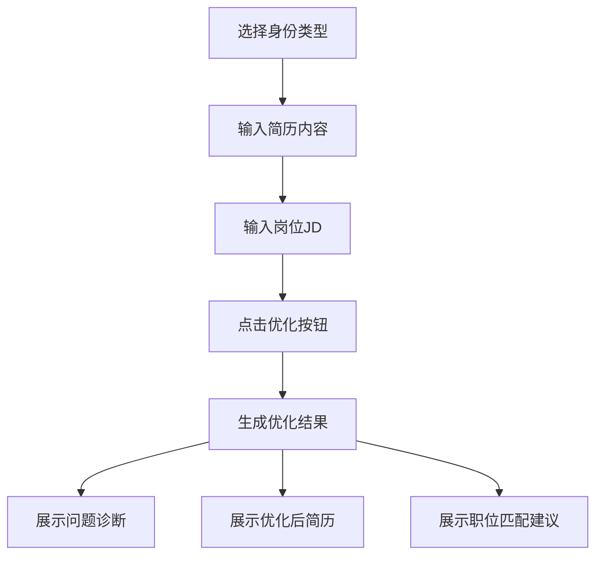

## 1. Product Overview
简历优化工具是一款帮助用户提升简历质量的在线工具，通过分析用户简历与目标岗位JD的匹配度，提供专业的优化建议。目标用户包括应届生和职场人士，帮助他们在求职过程中脱颖而出。

## 2. Core Features

### 2.1 User Roles
| Role | Registration Method | Core Permissions |
|------|---------------------|------------------|
| 应届生 | 无需注册 | 使用简历优化工具 |
| 职场人 | 无需注册 | 使用简历优化工具 |

### 2.2 Feature Module
1. **简历优化页面**: 身份选择、简历输入、JD输入、优化结果展示

### 2.3 Page Details
| Page Name | Module Name | Feature description |
|-----------|-------------|---------------------|
| 简历优化页面 | 身份选择 | 用户选择自己的身份类型（应届生/职场人） |
| 简历优化页面 | 简历输入框 | 用户输入或粘贴简历内容 |
| 简历优化页面 | JD输入框 | 用户输入或粘贴目标岗位的JD描述 |
| 简历优化页面 | 优化按钮 | 点击后触发生成优化结果 |
| 简历优化页面 | 问题诊断 | 展示简历存在的问题和改进建议 |
| 简历优化页面 | 优化后简历 | 展示经过优化的简历内容 |
| 简历优化页面 | 职位匹配建议 | 展示简历与目标职位的匹配度分析和建议 |

## 3. Core Process
用户选择身份类型 → 输入简历内容 → 输入岗位JD → 点击优化按钮 → 查看问题诊断、优化后简历、职位匹配建议

## 4. User Interface Design

### 4.1 Design Style
- **主色调**: 深蓝色 (#1e40af)，传达专业、信任的感觉
- **辅助色**: 浅蓝色 (#3b82f6)，用于按钮和高亮元素
- **中性色**: 白色背景、深灰色文字，确保清晰易读
- **按钮风格**: 圆角矩形，悬停时有颜色渐变效果
- **字体**: 思源黑体（Noto Sans SC），简洁现代
- **布局风格**: 卡片式布局，左侧输入区域，右侧结果展示区域
- **图标风格**: 使用 Lucide 图标库，简洁线条风格

### 4.2 Page Design Overview
| Page Name | Module Name | UI Elements |
|-----------|-------------|-------------|
| 简历优化页面 | 身份选择 | 两个切换按钮，选中状态有明显视觉区分 |
| 简历优化页面 | 输入区域 | 两个大文本框，带placeholder提示 |
| 简历优化页面 | 优化按钮 | 醒目的蓝色按钮，带有箭头图标 |
| 简历优化页面 | 结果区域 | 三个卡片，分别展示诊断、优化简历、匹配建议 |

### 4.3 Responsiveness
- **桌面端**: 左右分栏布局，左侧输入区域，右侧结果展示区域
- **移动端**: 上下布局，输入区域在上，结果区域在下，可滚动查看

### 4.4 3D Scene Guidance
不适用